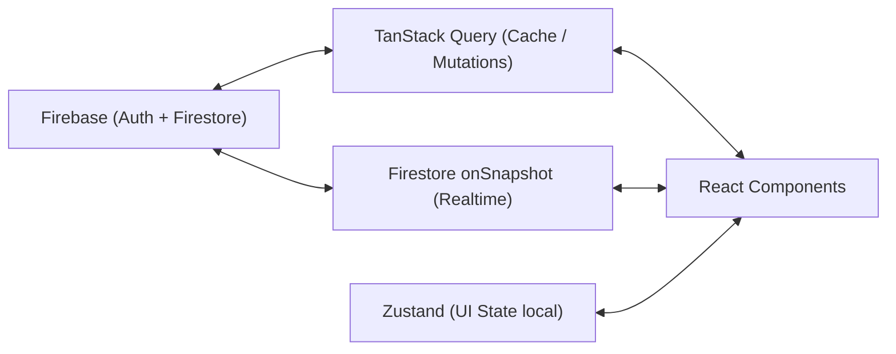

# 🗺️ Mapa del Sistema — Proyecto Tripio

> **Última actualización:** 10 de Marzo, 2026  
> **Estado del código:** MVP en desarrollo activo - Fase 1 completa, Fase 2 parcial, Fases 3/4 pendientes.

---

## 1. Arquitectura

El proyecto es una aplicación web Frontend Serverless que interactúa de forma directa con Firebase. Está construida usando **Next.js 15 (App Router)** y sigue los principios del **Feature-Sliced Design (FSD)**, donde los distintos dominios de negocio están encapsulados dentro de `/features`. 

El state management maneja el estado remoto (servidor/base de datos) a través de **@tanstack/react-query** más escuchadores en tiempo real (onSnapshot de Firestore). El estado global local (UI) puede ser manejado mediante **Zustand**. 

Adicionalmente, implementa soporte PWA local y cuenta con un entorno configurado de CI/CD local ayudado por **Husky**, **Lint-Staged** y **Vitest**.

### Flujo de datos

---

## 2. Carpetas Clave

| Carpeta | Contenido | Estado |
|---|---|---|
| `src/app/` | Rutas de Next.js (`layout.tsx`, `page.tsx`). Organización de la navegación de la app (rutas como `/trips/[tripId]`). | ⚡ Activo |
| `src/components/` | Componentes UI genéricos compartidos a nivel global. Sistema de diseño "Neumórfico" centralizado aquí. | ⚡ Activo |
| `src/features/` | Agrupa todo el código por dominio de negocio (e.g. `auth`, `trips`, `finances`, `proposals`). Contiene sus propios `api`, `components`, y `hooks`. | ⚡ Dominio Principal |
| `src/providers/` | Wrappers globales de contexto (e.g., `QueryClientProvider` para TanStack). | ✅ Configurado |
| `src/styles/` | Archivos CSS globales (`globals.css` importando Tailwind). | ✅ Configurado |
| `src/types/` | Definiciones TypeScript genéricas como `tripio.ts` representando los esquemas de base de datos. | ⚡ Activo |
| `src/lib/` | Instancias base como el cliente exportado de `firebase`. | ✅ Configurado |
| `Documentación/` | Archivos `.md` de control del proyecto (pendientes, SRD, mapa del sistema, guías). | ✅ Completa |
| `.templates/` | Configuración de micro-scaffolding con `plop`. | ✅ Configurado |
| `.agent/` & `.taskmaster/` | Herramientas, workflows y skills propios de IA. | ✅ Configurado |

---

## 3. Dependencias

### Core Frameworks
- `next` (^16.1.6) - Meta-framework React.
- `react`, `react-dom` (19.2.0) - Librería UI.

### Data Fetching & State
- `@tanstack/react-query` (^5.90.21) - Sincronizador de estado servidor asíncrono.
- `zustand` (^5.0.11) - Estado global ligero.

### BaaS (Backend as a Service)
- `firebase` (^12.10.0) - Base de datos NoSQL, Auth, Analytics y Storage.

### Formularios y Validación
- `react-hook-form` (^7.71.2) - Manejo de formularios sin renderizados innecesarios.
- `zod`, `@hookform/resolvers` - Creación y validación de schemas de tipo inferido.

### Estilos e UI
- `@tailwindcss/postcss`, `tailwindcss` y `postcss` - Framework de utilidades atómicas.
- `lucide-react` - Paquete de iconos.
- `clsx`, `tailwind-merge` - Utilidades para fusión de clases CSS condicionales.

### Tooling de Desarrollo Local

- Herramientas de testeo: `vitest`, `@testing-library/react`, `jsdom`.
- Formateo de código y hooks git: `eslint`, `prettier`, `husky`, `lint-staged`.
- PWA: `@ducanh2912/next-pwa`.

---

## 4. Puntos de Entrada

El control de los comandos se maneja a través de NPM.

| Comando | Función |
|---|---|
| `npm run dev` | Inicia entorno de desarrollo (Next.js) |
| `npm run build` | Compila bundle de producción |
| `npm run start` | Arranca el servidor de producción con la build actual |
| `npm run generate` | Llama a `plop` para scaffolding rápido (e.g., generar un componente o feature) |
| `npm run lint` | Chequea vulnerabilidades e inconsistencias de código con ESLint |
| `npm run test` | Corre los test unitarios a través de Vitest |

---

## 5. Stack Técnico General

- **Lenguajes:** TypeScript, CSS, HTML.
- **Frontend Framework:** React (+ Next.js en Client y Server Components).
- **Backend/DB:** Firebase (Firestore rules/indexes implementadas).
- **Styling Pipeline:** Tailwind CSS.
- **Workflow / Arquitectura:** Feature-Sliced Design.

---

## 6. Posibles Mejoras de Estructura detectadas

### 🔴 Atención Solicitada
1. **Doble Configuración de CSS:** `package.json` incluye `@tailwindcss/postcss` de una versión `4.x` pero a su vez en devDependencies existe `tailwindcss` y `postcss`. Next.js 15 y Tailwind v4 poseen canales de instalación distintos; podría haber scripts cruzados redundantes.
2. **Estado Global Solapado:** Existe `zustand`, sin embargo, gracias a los hooks y la estructura de `react-query` sumado a `onSnapshot`, hay muy poco lugar para el estado global sincrónico. Se debería evaluar su uso real para no cargar el bundle final de la app con dependencia inútil.
3. **Refactorización de UI Genérica:** En la carpeta de componentes existe código esparcido (modales dentro de `ui/dialog/Modal`, algunos expuestos a la raíz genérica como `NeumorphicInput`). Sería ventajoso crear una carpeta monolítica `components/neumorphic` e ingresarlos todos allí para centralizar el "design system" único.

