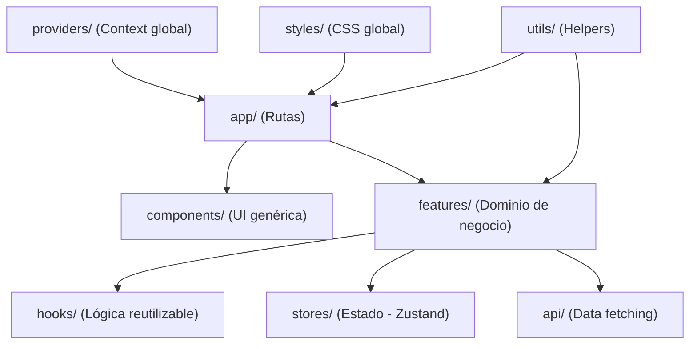
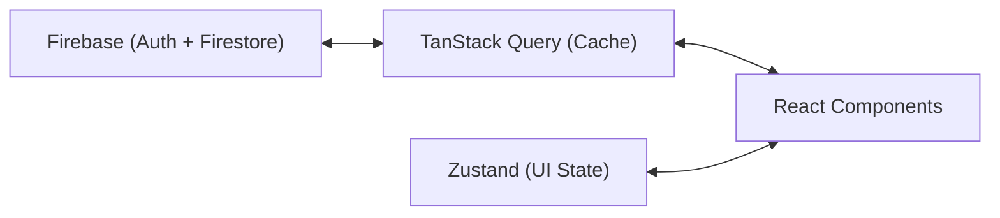

# 🗺️ Mapa del Sistema — Proyecto Tripio

> **Última actualización:** 4 de Marzo, 2026  
> **Estado del código:** Seed/Boilerplate — sin features implementadas aún

---

## 1. Arquitectura

### Patrón: Feature-Sliced Design (FSD)

El proyecto usa una arquitectura **Feature-Sliced Design** heredada del template "Next Seed". Agrupa código por funcionalidad de negocio en lugar de por tipo de archivo.



**Regla clave:** Si un componente tiene lógica de negocio → va en `features/`. Si es genérico → va en `components/`.

### Flujo de datos



---

## 2. Carpetas Clave

| Carpeta | Contenido | Estado |
|---|---|---|
| `src/app/` | Rutas Next.js App Router (`layout.tsx`, `page.tsx`, `favicon.ico`) | ⚡ Solo home básica |
| `src/components/` | Componentes UI genéricos (`HelloWorld/` con test) | ⚡ Solo placeholder |
| `src/features/` | Features de negocio (vacío, solo `.gitkeep`) | 🔴 Vacío |
| `src/hooks/` | Custom hooks globales (`.gitkeep`) | 🔴 Vacío |
| `src/providers/` | `AppProvider.tsx` — envuelve la app con `QueryClientProvider` | ✅ Configurado |
| `src/styles/` | `globals.css` — importa Tailwind, define `--color-primary` | ✅ Mínimo |
| `src/types/` | Types/Interfaces globales (`.gitkeep`) | 🔴 Vacío |
| `src/utils/` | `onCloseEvents.ts` — hook para cerrar overlays (Escape, click outside) | ✅ 1 utility |
| `.templates/` | Templates de Plop: `component/`, `feature/`, `page/` | ✅ Configurado |
| `.husky/` | Git hook `pre-commit` (lint-staged) | ✅ Configurado |
| `Documentación/` | Docs del proyecto (Objetivos, SRD v2.0, Pendientes MVP, etc.) | ✅ Completa |

---

## 3. Dependencias

### Producción

| Librería | Versión | Rol |
|---|---|---|
| `next` | ^16.1.6 | Framework principal (App Router) |
| `react` / `react-dom` | 19.2.0 | UI Library |
| `@tanstack/react-query` | ^5.90.21 | Data fetching, cache, sync con backend |
| `zustand` | ^5.0.11 | Estado global del cliente (UI state) |
| `@tailwindcss/postcss` | ^4.2.1 | Styling via PostCSS |

### Desarrollo

| Librería | Rol |
|---|---|
| `vitest` + `@vitest/ui` | Test runner |
| `@testing-library/react` + `jest-dom` + `dom` | Testing utilities |
| `eslint` + `eslint-config-next` | Linting |
| `prettier` | Formatting |
| `husky` + `lint-staged` | Git hooks (pre-commit) |
| `plop` | Scaffolding de componentes/features/pages |
| `tailwindcss` + `postcss` + `autoprefixer` | Compilación de estilos |
| `typescript` | Tipado estático |

### Servicios Externos (Planeados, NO conectados aún)

| Servicio | Rol |
|---|---|
| Firebase Auth | Autenticación (Google + Email) |
| Firebase Firestore | Base de datos NoSQL |
| Firebase Hosting / Vercel | Deploy de la PWA |

---

## 4. Puntos de Entrada

| Comando | Función |
|---|---|
| `npm run dev` | Inicia servidor de desarrollo en `localhost:3000` |
| `npm run build` | Build de producción |
| `npm start` | Servidor de producción |
| `npm run generate` | Scaffolding con Plop (component, feature, page) |
| `npm run lint` | ESLint |
| `npm run test` | Vitest (tests unitarios) |

### Generadores Plop

| Generator | Destino |
|---|---|
| `component` | `src/components/{Name}/` |
| `feature-component` | `src/features/{feature}/components/{Name}/` |
| `page` | `src/app/{route}/page.tsx` |
| `feature` | `src/features/{name}/` (api, components, hooks, types, stores) |

---

## 5. Stack Técnico

```text
┌──────────────────────────────────────────┐
│                FRONTEND                  │
│  Next.js 16 (App Router) + React 19     │
│  TypeScript 5 + Tailwind CSS 4          │
├──────────────────────────────────────────┤
│              STATE MGMT                  │
│  Zustand (Client UI) + TanStack Query   │
├──────────────────────────────────────────┤
│              BACKEND (planned)           │
│  Firebase Auth + Firestore              │
├──────────────────────────────────────────┤
│              TOOLING                     │
│  Vitest + Testing Library               │
│  ESLint + Prettier + Husky              │
│  Plop.js (Code Generation)              │
├──────────────────────────────────────────┤
│              DEPLOY (planned)            │
│  Vercel / Firebase Hosting (PWA)        │
└──────────────────────────────────────────┘
```

---

## 6. Mejoras de Estructura Pendientes

### 🔴 Crítico

- `package.json` dice `"name": "next-app-template"` → Renombrar a `"tripio"`
- `layout.tsx` metadata dice "Next Seed Template" → Actualizar a Tripio
- Firebase no está instalado → Instalar `firebase` y configurar SDK
- No hay PWA configurado → Agregar manifest + service worker

### 🟡 Importante

- `onCloseEvents.ts` referencia "Auralis" en comments → Limpiar
- No hay `.env.example` → Crear con variables de Firebase
- `globals.css` tiene un solo token → Expandir con design system

### 🟢 Nice-to-Have

- README sigue siendo del template → Actualizar para Tripio
- No hay `CONTRIBUTING.md` → Documentar convenciones

---

## 7. Resumen de Madurez

```text
Documentación   ██████████████████░░  90%
Infraestructura ████████░░░░░░░░░░░░  40%
Código          ██░░░░░░░░░░░░░░░░░░  10%
Tests           ██░░░░░░░░░░░░░░░░░░  10%
Deploy          ░░░░░░░░░░░░░░░░░░░░   0%
```
